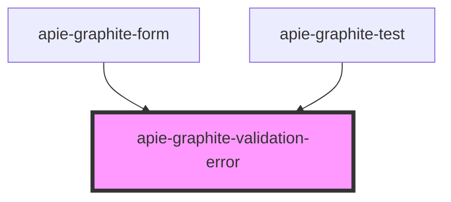

# apie-graphite-validation-error

<!-- Auto Generated Below -->

## Properties

| Property  | Attribute | Description | Type      | Default     |
| --------- | --------- | ----------- | --------- | ----------- |
| `message` | `message` |             | `string`  | `undefined` |
| `valid`   | `valid`   |             | `boolean` | `false`     |

## Dependencies

### Used by

 - [apie-graphite-form](../apie-graphite-form)
 - [apie-graphite-test](../apie-graphite-test)

### Graph

----------------------------------------------

*Built with [StencilJS](https://stenciljs.com/)*
